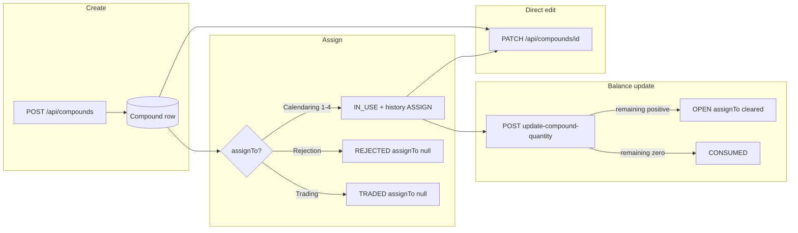

# Compounds module — architecture and flow

This document reverse-engineers the **Compounds** feature in this Next.js + Prisma app: UI, APIs, validation, weight/status logic, history, QR, reporting, RBAC, and extension points. It is written for teams cloning the pattern for a new parallel module.

**Related:** Existing internal notes live in `docs/compounds/README.md`. Where that file disagrees with code (e.g. post–balance-update status), **this document follows the codebase** as of the analysis date.

---

## 1. Module overview

### What is a Compound?

A **Compound** is a **batch record** for compound inventory: production metadata (code, name, date, batch/lot, location), **weight accounting** (batches × kg per batch = total produced; consumed vs remaining), optional **workflow status**, and optional **calendaring assignment** (`assignTo`). It is stored as the Prisma model `Compound` mapped to table `compounds`.

### Business purpose

- Register production of a compound batch with traceable identifiers (`compoundCode` unique, `batch`).
- Track **how much was produced** and **how much remains** in kg.
- Route material to **calendaring lines** (Calendaring 1–4) or mark **Rejection** / **Trading**.
- Support **shop-floor scanning**: QR codes resolve to the compound **detail page** URL.
- Support **list analytics** (derived status on list API), **dashboard analytics** (`/api/compounds/analytics/summary` + `computeCompoundAnalyticsSummary`), and **client-side exports** (PDF/Excel from list data).

### Key entities

| Entity | Prisma / table | Role |
|--------|----------------|------|
| Compound | `Compound` / `compounds` | Canonical batch row. |
| Compound history | `CompoundHistory` / `compound_histories` | Append-only style log for **ASSIGN** and **BALANCE_UPDATE** (and reserved **STATUS_CHANGE**). |
| User | `User` | `performedById` on history rows for assign/balance actions. |

### Core statuses (`CompoundStatus` enum)

Defined in `prisma/schema.prisma`:

- `IN_USE` — Assigned to a calendaring line (not rejection/trading).
- `PACKED` — Stored / not in calendaring use (often default display when fully in stock).
- `OPEN` — Partially consumed inventory (also used after balance update when remaining > 0).
- `ASSIGNED` — Legacy / schema consistency; list API maps this to **display** `OPEN` for backward compatibility.
- `CONSUMED` — No remaining weight (or explicit terminal state).
- `TRADED` — Disposition via assign flow “Trading”.
- `REJECTED` — Disposition via assign flow “Rejection”.

### Lifecycle stages (conceptual)



**Important:** **PATCH** updates fields and recomputes totals/remaining but **does not** append `CompoundHistory` rows. Only **assign** and **balance update** APIs write history today.

---

## 2. Full user journey (step-by-step)

1. **List compounds** — User opens `/compounds`. Client `fetch('/api/compounds')` (requires `COMPOUND_BATCH_VIEW`). Rows are filtered by status tabs, searched, paginated in the table; optional **Get reports** uses the same in-memory list.
2. **Create compound** — User goes to `/compounds/new`, fills `CompoundNewForm`, submits → `POST /api/compounds` with JSON body (requires `COMPOUND_BATCH_CREATE`). Server validates `createCompoundSchema`, computes `totalWeightProducedKg` and `weightRemainingKg`, persists. No history row on create.
3. **QR without extra step** — Detail page and print flow encode `{baseUrl}/compounds/{id}`. QR is **not** stored in DB; it is generated on demand (API route or client `qrcode` library).
4. **View detail** — `/compounds/[id]` is a **Server Component** that uses `prisma.compound.findUnique` with `history` ordered ascending. No RBAC check in the page file itself (see risks).
5. **Assign** — If `assignTo` is empty and status is not `REJECTED`/`TRADED`, user sees **Assign Compound** → `POST /api/compounds/[id]/assign` → transaction: update compound + `CompoundHistory` **ASSIGN**.
6. **Update balance** — After assignment, user sees **Update Balance** → `POST /api/compounds/[id]/update-compound-quantity` with `{ quantity }` = **closing remaining kg** → transaction: update weights + status (`OPEN` or `CONSUMED`) + **BALANCE_UPDATE** history. If status becomes `OPEN`, `assignTo` is cleared.
7. **Edit compound** — `/compounds/[id]/edit` loads via `GET /api/compounds/[id]`, then `PATCH /api/compounds/[id]` with `updateCompoundSchema` partial fields (requires `COMPOUND_BATCH_UPDATE`).
8. **Print label** — From list row actions, client builds same URL as QR, generates PNG data URL, calls `getSingleCompoundPdfBlob` (`@/components/pdf/Single-Compound-Pdf`).
9. **Delete** — List row delete → `DELETE /api/compounds/[id]` (cascade deletes histories).
10. **Analytics dashboard** — `/analytics/compounds` uses React Query to call `GET /api/compounds/analytics/summary` with query params (location, compound name filter, date range, granularity, slow days).
11. **Settings placeholder** — `/settings/compounds` is a stub heading only; **compound_master:**\* permissions exist in RBAC but are not wired to batch CRUD in this tree.

---

## 3. Route architecture

### App Router (UI)

| Route path | File | Purpose | Data source | Actions |
|------------|------|---------|---------------|---------|
| `/compounds` | `(main-app)/compounds/page.tsx` | List, tabs, search, pagination, delete confirm, reports dialog | Client `GET /api/compounds` | Refresh, navigate to new/edit/detail, delete, open reports |
| `/compounds/new` | `(main-app)/compounds/new/page.tsx` | Create form shell | — | Embeds `CompoundNewForm` |
| `/compounds/[id]` | `(main-app)/compounds/[id]/page.tsx` | Detail, QR image, history timeline, assign/balance dialogs | Server `prisma.compound.findUnique` + `history` | Links back; client dialogs call APIs |
| `/compounds/[id]/edit` | `(main-app)/compounds/[id]/edit/page.tsx` | Edit shell | Client `GET /api/compounds/[id]` | `CompoundEditForm` → `PATCH` |
| `/compounds/layout.tsx` | layout | `max-w-7xl` wrapper | — | — |
| `/analytics/compounds` | `(main-app)/analytics/compounds/page.tsx` | Analytics dashboard | `GET /api/compounds/analytics/summary` | Filters in `compound-analytics-dashboard.tsx` |
| `/settings/compounds` | `(main-app)/settings/compounds/page.tsx` | Placeholder | — | — |

**Navigation:** `src/components/app-sidebar.tsx` groups Overview (`/compounds`), Analytics (`/analytics/compounds`), Settings (`/settings/compounds`).

### HTTP API (batch)

| Route | Handler file | Methods | RBAC permission |
|-------|----------------|---------|-----------------|
| `/api/compounds` | `src/app/api/compounds/route.ts` | `GET`, `POST` | `COMPOUND_BATCH_VIEW`, `COMPOUND_BATCH_CREATE` |
| `/api/compounds/[id]` | `src/app/api/compounds/[id]/route.ts` | `GET`, `PATCH`, `DELETE` | `COMPOUND_BATCH_VIEW`, `COMPOUND_BATCH_UPDATE`, `COMPOUND_BATCH_DELETE` |
| `/api/compounds/[id]/assign` | `.../[id]/assign/route.ts` | `POST` | `COMPOUND_BATCH_UPDATE` |
| `/api/compounds/[id]/update-compound-quantity` | `.../[id]/update-compound-quantity/route.ts` | `POST` | `COMPOUND_BATCH_UPDATE` |
| `/api/compounds/[id]/qrcode` | `.../[id]/qrcode/route.ts` | `GET` | **None** (public PNG for scanning) |
| `/api/compounds/analytics/summary` | `.../analytics/summary/route.ts` | `GET` | `COMPOUND_BATCH_VIEW` |

---

## 4. Form architecture

### Shared UI

Both create and edit use:

- `@tanstack/react-form` (`useForm`)
- `@/components/ui/*` — `Card`, `Field` / `FieldGroup` / `FieldLabel`, `Input`, `Select`, `Calendar` + `Popover`, `Button`
- `CompoundStatus` from `@/generated/prisma/enums` for status dropdown options
- `sonner` toasts for errors/success

There is **no shared Zod resolver on the client**; the server owns schema validation via `src/schemas/compoundSchema.ts`.

### Validation schemas (server)

**File:** `src/schemas/compoundSchema.ts`

- **`createCompoundSchema`** — Zod object: required trimmed strings (`compoundCode`, `dateOfProduction` ISO string, `createdBy`, `compoundName`, `batch`, `location`), `batchCount` positive, `weightPerBatchKg` ≥ 0, optional `totalWeightProducedKg` ≥ 0, `weightConsumedKg` optional default 0, optional nullable `status` as `z.nativeEnum(CompoundStatus)`.
- **`updateCompoundSchema`** — `createCompoundSchema.partial()` (any subset).

**Route-local Zod:**

- Assign: `assignCompoundSchema` in `assign/route.ts` — `{ assignTo: z.string().min(1) }`.
- Balance: `updateCompoundQuantitySchema` in `update-compound-quantity/route.ts` — `{ quantity: z.coerce.number().min(0) }`.

### Create vs edit (client)

| Aspect | `CompoundNewForm` (`components/forms/compound/new/index.tsx`) | `CompoundEditForm` (`components/forms/compound/edit/index.tsx`) |
|--------|----------------------------------------------------------------|-------------------------------------------------------------------|
| Defaults | Empty strings / optional date; `createdBy` from `useSession()` (name or `mobileNumber`) | From `CompoundEditInitial` prop (loaded on edit page) |
| Extra fields | — | `totalWeightProducedKg` editable (create relies on server-only product of batch × weight unless optional total sent — create form does **not** send `totalWeightProducedKg`) |
| Client required checks | compoundCode, compoundName, batch, location, date, numeric validations, createdBy | date, numerics, createdBy; **does not** re-require code/name/batch/location empty-string checks (assumes existing row) |
| HTTP | `POST /api/compounds` | `PATCH /api/compounds/${compoundId}` |
| Redirect | `/compounds` | `/compounds/${compoundId}` |
| Status clear | Omit `status` from body if empty | Sends `status: null` explicitly when cleared |

**Edit page data load:** `(main-app)/compounds/[id]/edit/page.tsx` maps `json.data` into `CompoundEditInitial` (including `weightRemainingKg` in the type though the edit form does not expose remaining as a direct field — remaining is implied by produced/consumed).

### Submission pipelines

**Create**

1. `useForm` `onSubmit` → inline validation → `fetch` POST JSON.
2. `POST /api/compounds` → `withRBAC` → `createCompoundSchema.safeParse` → `computeTotals` in `route.ts` (must match `batchCount × weightPerBatchKg` within `TOTAL_TOLERANCE = 1e-6`) → `prisma.compound.create`.

**Edit**

1. `PATCH /api/compounds/[id]` → `updateCompoundSchema.safeParse` → merge with `existing` row → recompute `totalWeightProducedKg` / `weightRemainingKg` when batch/weight fields participate → `prisma.compound.update`.

---

## 5. State machine / status logic

### Stored vs displayed (list API)

**Function:** `deriveCompoundDisplayStatus(compound)` in `src/app/api/compounds/route.ts`

Order of checks:

1. If `compound.status === 'REJECTED'` → display `REJECTED`
2. If `compound.status === 'TRADED'` → `TRADED`
3. If `compound.status === 'CONSUMED'` → `CONSUMED`
4. If `compound.status === 'IN_USE'` → `IN_USE`
5. Else quantity-derived:
   - `weightRemainingKg <= 0` → `CONSUMED`
   - `weightRemainingKg < totalWeightProducedKg` → `OPEN`
6. If `compound.status === 'ASSIGNED'` → `OPEN` (legacy)
7. Else → `(compound.status ?? 'PACKED')`

So **list rows** may show `OPEN`/`CONSUMED` even when DB `status` is null, based purely on weights.

### Assign API (`POST .../assign`)

| `assignTo` body value | `Compound` updates | `statusAfter` in history |
|----------------------|--------------------|---------------------------|
| `Rejection` | `status: REJECTED`, `assignTo: null` | `REJECTED` |
| `Trading` | `status: TRADED`, `assignTo: null` | `TRADED` |
| `Calendaring 1`–`4` | `assignTo: value`, `status: IN_USE` | `IN_USE` (or existing if not overwritten in variable — see code: `statusAfter = updateData.status ?? existing.status`) |

**Machinery mapping:** `CALENDARING_TO_MACHINERY` maps display strings to `CompoundMachinery` enum `CAL_1` … `CAL_4` for `assignedMachinery` on history. **Rejection/Trading** do not set machinery.

### Balance update API (`POST .../update-compound-quantity`)

- Validates `quantity` ≤ `existing.totalWeightProducedKg`.
- Sets `weightRemainingKg = quantity`, `weightConsumedKg = totalWeightProducedKg - quantity`.
- Sets `status` to **`OPEN`** if `quantity > 0`, else **`CONSUMED`**.
- If `status === 'OPEN'`, also sets **`assignTo: null`** (clears calendaring assignment).
- Writes `CompoundHistory` with `actionType: 'BALANCE_UPDATE'` and weight + status before/after.

### UI gates (detail page)

`UpdateCompoundBalanceDialog` is shown only when:

- `compound.status` is not `REJECTED` or `TRADED`, **and**
- `assignTo` is non-null and non-empty string.

Otherwise **`AssignCompoundDialog`** is shown first.

**Note:** There is no server-side duplicate of this gate inside the POST handlers; a client could theoretically call APIs directly.

### `STATUS_CHANGE` enum value

`CompoundHistoryAction.STATUS_CHANGE` exists in Prisma and the detail UI renders it with a “Status change” label, but **no API in this repo creates `STATUS_CHANGE` rows** today (confirmed via codebase search). Assign/balance carry `statusBefore`/`statusAfter` on their own rows.

---

## 6. QR code flow

| Concern | Implementation |
|---------|----------------|
| **Where generated** | (1) `GET /api/compounds/[id]/qrcode` — server `QRCode.toDataURL` → PNG buffer. (2) List **Print** action — client `QRCode.toDataURL` in `columns.tsx`. (3) Detail page `<Image src={/api/compounds/${id}/qrcode} />`. |
| **Data encoded** | `{baseUrl}/compounds/{id}` where `baseUrl = (process.env.NEXT_PUBLIC_API_URL \|\| getBaseUrl(request)).replace(/\/$/, '')` on server; client print uses `process.env.NEXT_PUBLIC_API_URL ?? window.location.origin`. |
| **Trigger timing** | On image request (server) or on print click (client). |
| **Update behavior** | Stateless: URL is stable for a given `id`; no regeneration DB field. |
| **Display locations** | Compound detail card; printable PDF via list row. |
| **Auth** | QR route is **public** (comment in `qrcode/route.ts`: so physical labels work without session). |

---

## 7. Balance management logic

| Concept | Rule |
|---------|------|
| **Initial balance** | On create: `weightRemainingKg = totalWeightProducedKg - weightConsumedKg` (clamped ≥ 0 in API). |
| **Updates (dialog)** | User enters **closing remaining kg** (`quantity`). Consumed becomes `total - quantity`. |
| **Deductions** | Any reduction in remaining implies an increase in consumed via the same formula (not a separate “delta” ledger). |
| **History** | Each balance POST inserts one `BALANCE_UPDATE` row with before/after remaining and consumed, plus status before/after. |
| **Status effects** | Remaining > 0 → `OPEN` + clear `assignTo`. Remaining = 0 → `CONSUMED`. |
| **Edge cases** | `quantity > totalWeightProducedKg` rejected; negative rejected; PATCH can still set consumed/produced inconsistently if caller crafts body — server validates consumed ≤ total on PATCH. |

---

## 8. Database + backend flow

### Models (Prisma)

See `prisma/schema.prisma` models `Compound` and `CompoundHistory`, enums `CompoundStatus`, `CompoundHistoryAction`, `CompoundMachinery`.

**Cascade:** `CompoundHistory` uses `onDelete: Cascade` from `Compound`.

### Key server functions / helpers

| Name | Location | Role |
|------|----------|------|
| `computeTotals` / merge logic | `api/compounds/route.ts`, `api/compounds/[id]/route.ts` | Enforce total = batch × per-batch; remaining = total − consumed. |
| `deriveCompoundDisplayStatus` | `api/compounds/route.ts` | List GET response shaping. |
| `computeCompoundAnalyticsSummary` | `src/lib/compoundAnalytics.ts` | Dashboard aggregates (totals, timelines, slow movers, etc.). |
| `withRBAC` | `src/lib/rbac/rbac.ts` | Session + permission gate for APIs. |
| `auth()` | `update-compound-quantity`, `assign` routes | Resolve `performedById` for history. |

### Mutations vs queries summary

- **Queries:** `GET /api/compounds`, `GET /api/compounds/[id]`, `GET .../analytics/summary`, detail page direct Prisma read.
- **Mutations:** `POST`, `PATCH`, `DELETE` on compound; `POST` assign; `POST` update quantity.
- **Side effects:** Assign and balance run `prisma.$transaction` with `compoundHistory.create`. PATCH/POST create/delete do not append history (except create/delete whole row).

---

## 9. Reporting system

### List-based reports (client-only)

**Entry:** `GetReportsDialog` from compounds list page (`get-reports-dialog.tsx`).

- **Input data:** Full `compounds` array from last successful `GET /api/compounds` (not filtered by current tab — categories filter inside `prepareCompoundsForCategoryReport`).
- **Categories:** `all`, `OPEN`, `IN_USE`, `PACKED`, `CONSUMED`, `TRADED`, `REJECTED`.
- **PDF:** `@react-pdf/renderer` via `getCompoundListReportPdfBlob` (`pdf/compound-list-report-pdf.tsx`), using `COMPOUND_REPORT_COLUMNS` and `buildCompoundReportCellValues` from `compound-list-report-shared.ts`.
- **Excel:** `xlsx` in `excel/compound-list-report-excel.ts` — sheet “Compounds”, title + generated timestamp rows.
- **Single compound print:** `getSingleCompoundPdfBlob` — small label PDF with embedded QR image.

### Analytics “reports”

Interactive charts/tables on `/analytics/compounds` backed by `GET /api/compounds/analytics/summary` (server aggregates + `computeCompoundAnalyticsSummary`). This is **not** the same PDF/Excel export pipeline.

---

## 10. Reusable patterns for a new module

| Pattern | Compounds implementation | Suggestion for clone |
|---------|-------------------------|----------------------|
| **Folder structure** | `(main-app)/<module>/page.tsx`, `[id]/page.tsx`, `[id]/edit/page.tsx`, `new/page.tsx`, colocated `columns.tsx`, `data-table.tsx`, `utils.ts`, `search-utils.ts`, reports subfolder | Mirror for consistency. |
| **API layout** | `src/app/api/<module>/route.ts`, `[id]/route.ts`, specialized subroutes under `[id]/` | Same nesting for sub-actions. |
| **Validation** | `src/schemas/<module>Schema.ts` + route-local Zod for special actions | Keep “fat server, thin client” validation. |
| **RBAC** | `withRBAC(request, Permission.XXX, handler)` per method | Add permissions to `permissions.ts` + `role-defaults.ts`. |
| **List + display status** | Optional: derive display status in GET list for UI tabs | If DB enum lags reality, centralize derivation one place. |
| **History table** | Separate model + `actionType` enum; transaction with parent update | Same for audit trail. |
| **QR** | Public `GET .../qrcode` + optional client duplicate for print | Reuse `getBaseUrl` / `NEXT_PUBLIC_API_URL` convention. |
| **Forms** | TanStack Form + Card layout + toast errors | Extract a shared “resource form shell” if you repeat many fields. |
| **Reports** | Shared column metadata + PDF + Excel from same row type | Parameterize column defs and filename helpers. |

---

## 11. Risks / coupling

| Risk | Detail |
|------|--------|
| **Detail page bypasses API RBAC** | `[id]/page.tsx` reads Prisma directly. Any authenticated layout user who can guess an id may see data unless outer auth/middleware restricts routes (no `middleware.ts` found in repo snapshot). List/edit APIs still enforce permissions. |
| **Public QR route** | Anyone with the image URL can resolve compound id and hit the **public** detail URL pattern; product exposure depends on app-level auth for `/compounds/[id]`. |
| **Dual status truth** | DB `status` vs `deriveCompoundDisplayStatus` vs balance POST forcing `OPEN`/`CONSUMED` — consumers must know which layer they read. |
| **PATCH without audit** | Manual corrections do not log `CompoundHistory`, so timeline is incomplete vs real-world ops. |
| **`STATUS_CHANGE` unused** | UI handles it but no writer — dead path or future feature. |
| **`COMPOUND_MASTER_*` permissions** | Defined and grouped in RBAC but **settings page is empty**; risk of confusion for operators. |
| **Assign options duplicated** | `ASSIGN_OPTIONS` in `assign-compound-dialog.tsx` must stay in sync with server `CALENDARING_TO_MACHINERY` and rejection/trading strings. |
| **Documentation drift** | `docs/compounds/README.md` may describe older balance→status behavior; treat code as authoritative. |

---

## 12. Build blueprint for a similar module

### Reuse as-is or with minimal rename

- `withRBAC` + `Permission` enum pattern.
- Prisma model + history model with `actionType` and `performedById`.
- `src/schemas/*Schema.ts` + `.partial()` for PATCH.
- TanStack Table list (`data-table.tsx` pagination + external search string).
- Toast + `fetch` client mutations (no server actions in compounds batch flow).
- QR PNG route pattern using `qrcode` + `getBaseUrl`.

### Abstract first (if building N modules)

- **Generic “resource detail” guard** — optional permission check wrapper for RSC data loads aligned with API permissions.
- **History writer helper** — single internal function `recordHistory({ type, before, after })` called from PATCH variants to avoid silent edits.
- **Assign / disposition config** — drive labels and server mappings from one shared config object.
- **Display status** — single module-level function used by both GET list and UI badges to avoid drift with `getCompoundStatusBadgeVariant`.

### Generalize carefully

- **Public QR** vs authenticated pages — decide per security model (token-in-QR vs open id).
- **Analytics** — `compoundAnalytics.ts` is large and domain-specific; extract shared date bucketing / “slow mover” patterns if second module needs identical KPIs.

---

## Appendix A — Permission enum values (batch)

From `src/lib/rbac/permissions.ts`:

- `COMPOUND_BATCH_VIEW = 'compound_batch:view'`
- `COMPOUND_BATCH_CREATE = 'compound_batch:create'`
- `COMPOUND_BATCH_UPDATE = 'compound_batch:update'`
- `COMPOUND_BATCH_DELETE = 'compound_batch:delete'`

**Admin** bypasses permission checks in `hasPermission` (`userRole === 'Admin'`).

---

## Appendix B — Route tree (compact)

```
(compounds UI)
/compounds                    → list + reports dialog
/compounds/new                → create form
/compounds/[id]               → detail + QR + dialogs + history
/compounds/[id]/edit          → edit form

(analytics)
/analytics/compounds          → dashboard (React Query → summary API)

(settings)
/settings/compounds           → placeholder

(API)
/api/compounds
/api/compounds/[id]
/api/compounds/[id]/assign
/api/compounds/[id]/update-compound-quantity
/api/compounds/[id]/qrcode
/api/compounds/analytics/summary
```

---

## Appendix C — Primary file index

| Area | Files |
|------|--------|
| Forms | `src/components/forms/compound/new/index.tsx`, `edit/index.tsx` |
| List UI | `src/app/(main-app)/compounds/page.tsx`, `columns.tsx`, `data-table.tsx`, `search-utils.ts`, `utils.ts`, `get-reports-dialog.tsx`, `compound-list-report-shared.ts`, `pdf/`, `excel/` |
| Detail | `src/app/(main-app)/compounds/[id]/page.tsx`, `assign-compound-dialog.tsx`, `update-compound-balance-dialog.tsx` |
| APIs | `src/app/api/compounds/**/*.ts` |
| Schemas | `src/schemas/compoundSchema.ts` |
| Analytics lib | `src/lib/compoundAnalytics.ts` |
| PDF label | `src/components/pdf/Single-Compound-Pdf.tsx` |
| Prisma | `prisma/schema.prisma` (`Compound`, `CompoundHistory`, enums) |

This file is the **onboarding + architecture map** for the Compounds module and a **blueprint** for parallel modules; keep it updated when APIs or status rules change.
